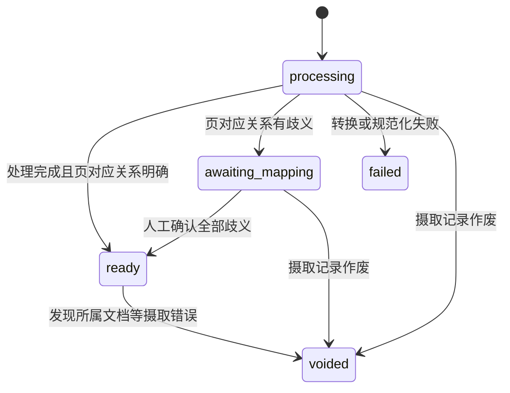
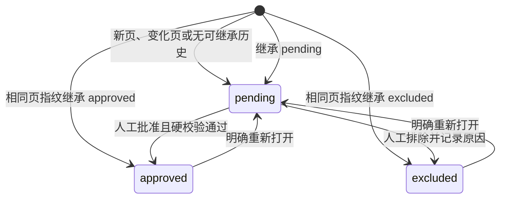

# 分离文档、版本、页与页版本的身份和状态

系统需要在反复上传、换页、重复页、软删和人工策展之间保持稳定身份，又不能把不确定的页对应关系或过期审核静默带入产物。我们决定让文档与页承担跨版本身份，让不可变的版本与页版本承载历史；审核状态只属于已启用策展的页版本，生命周期、处理状态和审核状态彼此正交。自动继承只发生在页对应关系明确且页指纹相同的情况下，任何歧义都在新版本成为当前版本前由人确认。

## 身份与记录

- `document_id` 由系统生成且跨上传稳定；文件名和内容哈希不是文档身份。新版本必须明确指向已有文档，版本建立后不得改换所属文档。
- 版本不可变。回滚会基于旧内容创建新版本，不倒转历史。
- 页是文档内跨版本稳定的逻辑身份；页码只是页版本在某一版本中的位置。
- 页版本是一页在某一版本中的不可变内容记录，承载页码、页指纹与来源内容。审核状态属于页版本，不属于页。
- 重复页即使页指纹相同，也分别拥有不同的 `page_id`、`chunk_id` 和审核历史。页指纹只证明内容是否相同，不承担身份。
- `chunk_id` 与页一一对应并跨版本稳定；页被软删时保留，页恢复时继续沿用。

## 版本处理与当前版本

版本的处理状态为 `processing`、`awaiting_mapping`、`ready`、`failed` 或 `voided`。“当前版本”不是处理状态，而是文档指向某个 `ready` 版本的关系。

- 新版本只有达到 `ready` 后才能原子替换当前版本；在此之前，旧的当前版本继续用于策展和产物。
- 默认未启用的隐藏页只登记，不阻塞版本达到 `ready`。
- `failed` 和 `voided` 版本不能成为当前版本。错误版本保留审计记录但不进入策展或产物；当前版本取最近一个未作废的 ready 版本。
- 把版本作废是纠正“该版本从未有效”的摄取错误；回滚则是重新采用一个曾经有效的历史内容，两者不能混用。

## 页对应关系

跨版本对应采用保守分层匹配：

1. 在未匹配页中，唯一且相同的页指纹直接确认属于同一页，换位不影响身份。
2. 其余页可用源 SlideID、相邻的已确认页和相对顺序生成候选；这些信号只作证据，不能单独充当身份。
3. SlideID 冲突、重复页或多种对应同样合理时，版本进入 `awaiting_mapping`。人必须逐项确认“沿用哪一页”或“这是新页”。
4. 人工确认记录操作人、时间、新旧页版本、系统候选和采用的证据。版本成为当前版本后不得直接改写对应关系；纠错需作废版本并重新摄取。

未获确认的新页不得继承身份或审核。被确认属于同一页但页指纹变化时，沿用 `page_id` 和 `chunk_id`，创建 pending 页版本。

## 审核状态机

已启用策展的页版本具有 `pending`、`approved` 或 `excluded` 审核状态。隐藏页默认未启用策展，因此没有审核状态；人工启用并处理后才按正常规则进入审核状态。

- 页指纹未变时，新页版本从同一页的全部历史中选择最近一个相同页指纹的页版本，继承其审核状态、标注和审核信息，不局限于紧邻版本。这覆盖页换位、回滚和软删后重新出现。
- 页指纹变化或找不到相同历史时，页版本进入 `pending`。旧内容只能作为待确认的预填，不能作为正式审核结果。
- approved 或 excluded 页版本必须先重新打开为 `pending` 才能编辑。重新打开后，旧审核信息只保留在审计记录中；再次批准或排除会产生新的操作人、时间和来源版本。
- 继承 approved 时原样保留 `approved_at`、`approved_by` 和 `approval_version_id`；继承 excluded 时同样保留原排除人、时间、原因和来源版本。新页版本另记继承来源页版本及所依据的页指纹。
- excluded 必须由人设置，记录 `excluded_by`、`excluded_at`、来源版本、可选说明和原因：`no_meaningful_content`、`duplicate`、`irrelevant`、`unreadable` 或 `other`。系统不得自动排除页。

## 生命周期与事件迁移

| 事件 | 版本或文档 | 页 | 页版本审核状态 |
| --- | --- | --- | --- |
| 首次上传 | 版本处理完成且对应明确后成为当前版本 | 创建页身份 | 已启用的新页为 pending；隐藏页无审核状态 |
| 上传新版本 | ready 后原子替换当前版本，旧版本只读 | 按页对应关系沿用或创建身份 | 相同页指纹继承；变化页或新页为 pending |
| 页换位 | 当前版本正常生效 | 对应明确时沿用 page_id | 页指纹未变则完整继承 |
| 页从新版本消失 | 版本正常生效 | 页软删，不创建缺席的页版本 | 历史审核不变，不进入当前产物 |
| 软删页重新出现 | 版本正常生效 | 对应明确时恢复原 page_id | 最近的相同页指纹历史可继承，否则 pending |
| 人工启用隐藏页 | 当前版本不变 | 处理已登记的隐藏页 | 按历史继承或进入 pending |
| 文档软删 | 当前版本保留但停止参与业务 | 页生命周期和身份不变 | 审核历史不变，不进入策展或产物 |
| 文档恢复 | 恢复原当前版本 | 页生命周期不变 | 继续使用原审核状态 |
| 回滚 | 以旧内容创建新版本并走完整处理 | 按正常页对应关系处理 | 按正常历史继承规则处理 |
| 错误版本作废 | 版本保留但标为 voided | 该版本不再贡献当前页 | 不进入策展或产物；审计保留 |

软删不是审核结论：页因不再存在于当前版本而软删，文档因业务移除而软删；两者都不把页版本改成 excluded。excluded 则表示页仍存在，但人明确决定它不进入产物。

## 视觉对象继承

| 情况 | `visual_ref` | 处置、正式标注与裁剪范围 | 视觉资产 |
| --- | --- | --- | --- |
| 页指纹未变 | 原样沿用 | 原样继承 | 页渲染、裁剪范围和渲染参数均未变时可复用，否则确定性重建 |
| 页指纹变化 | 全部生成新身份 | 仅在源元素、内容和范围高置信对应时复制为待确认预填；否则只并排展示旧内容 | 不按身份继承；相同字节仍可按内容哈希去重 |

变化页上的预填必须记录来源旧 `visual_ref`，但不得沿用旧身份。所有预填都需由人重新确认后才能成为正式标注。

## Consequences

这套模型优先避免错误继承：重复页和来源工具重写 SlideID 时可能增加一次人工确认，但不会把错误标注或稳定 ID 静默交给下游。存储层必须分别保存稳定身份、不可变历史、当前版本关系、处理状态、审核事件、软删墓碑和继承溯源；摄取接口必须把 `awaiting_mapping` 暴露为可操作状态，审核界面必须提供页对应关系确认入口。
