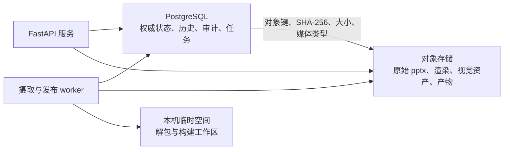

# 以 PostgreSQL 保存权威状态，以对象存储保存内容寻址二进制

系统需要同时保存强关系、不可变历史、人工策展审计、大体积二进制和可恢复的异步任务；页对应确认、版本生效及发布切换又要求可靠事务。我们决定让 PostgreSQL 成为全部结构化状态的唯一权威存储，让 S3 兼容对象存储承载二进制对象，并以关系化冻结清单连接两者。初版不采用 SQLite、数据库大字段、事件溯源或独立消息代理，因为这些方案分别会引入迁移风险、备份膨胀、不必要的读取复杂度或额外运维面。

## 存储职责

- **PostgreSQL** 保存文档、版本、源页清单、页、页版本、页对应关系、策展快照、视觉对象、标注、审核事件、幂等键、持久任务、发布候选、发布冻结清单、当前产物指针及对象元数据。它是领域事实和任务协调的唯一权威来源。
- **对象存储** 保存原始 `.pptx`、单页投影、整页渲染、视觉资产和产物 ZIP。生产环境使用 S3 兼容实现；开发环境可以使用遵循相同接口和内容校验规则的文件系统适配器。数据库不保存大块二进制。
- **本机临时空间** 只用于 OOXML 解包、转换器和 ZIP 构建的工作目录。进程退出后可全部丢失，不得作为恢复或重试依据。

## 核心记录与约束

### 身份与不可变历史

- 文档记录持有稳定 `document_id`、软删信息和可空的当前版本指针。当前版本指针只能引用同一文档中未作废的 ready 版本。
- 版本记录持有稳定 `version_id`、所属文档、原始对象引用、源文件 SHA-256、来源关系（首次摄取、重试或回滚）及处理状态。源文件和版本归属创建后不可修改；状态迁移另写追加式事件。
- 每个版本先保存不可变的**源页清单记录**，包含源引用、原始 1 基页序和隐藏标记。隐藏页默认到此为止，因此不会伪造缺少来源内容和页指纹的页版本；日后启用并处理时，再为同一清单记录追加页版本。
- `processing` 与 `awaiting_mapping` 阶段的转换内容、候选证据和页对应决定保存在独立暂存记录中。全部必需对应确定后，最终事务才创建或沿用页身份、生成不可变页版本并冻结对应关系。
- 页记录持有稳定 `page_id` 和全局唯一 `chunk_id`，且只能属于一个文档。页版本必须同时引用一个版本、同文档的页及该版本唯一的源页清单记录；同一版本中的源页序和源页清单引用均不得重复。页指纹不是唯一键，重复页可以拥有相同指纹。
- 文档、版本、页和页版本之间使用包含 `document_id` 的复合外键，防止跨文档误连。数据库以外键、唯一约束、检查约束和部分唯一索引保证可声明的结构不变量。

### 策展、审核与 JSONB 边界

- 每次保存标注、视觉对象处置或裁剪范围都产生不可变策展快照；独立的当前指针提供快速读取。批准、排除、重新打开、继承和人工页对应确认均写入追加式事件，不覆盖历史内容。
- approved 或 excluded 指向的策展快照保持冻结；重新打开后产生新的 pending 快照。继承会记录来源页版本、来源策展快照、原操作人和原操作时间。变化页的预填同样记录来源，但不能充当正式审核结果。
- `visual_ref` 全局唯一。页指纹变化后不得复用；相同字节的视觉资产仍可按内容哈希去重。视觉对象、标注子项、显示顺序及视觉资产引用采用关系记录和外键，不能只藏在 JSONB 中。
- anydoc 归一化页内容、页对应候选证据、任务进度和错误详情可以使用带 `schema_version` 的 JSONB。身份、状态、顺序、审核信息以及任何影响引用完整性的字段必须关系化。
- 当前关系表和当前指针用于正常查询，追加式事件用于审计；事件不是重建全部系统状态的唯一来源，因此本系统不是事件溯源架构。

### 幂等与任务协调

- 幂等键按操作者、路由、目标资源和键值建立唯一约束，并保存请求指纹及原响应资源；同键不同请求由事务拒绝。
- 每个文档最多存在一个非终态摄取任务，系统全局最多存在一个非终态发布任务，均由部分唯一索引保证。
- 摄取和发布任务保存在 PostgreSQL 中。worker 使用 `FOR UPDATE SKIP LOCKED`、租约到期时间和尝试次数认领任务；交付语义为至少一次，因此每个阶段都必须按输入哈希、工具版本和稳定目标身份幂等。
- 转换、渲染和指纹等中间结果按页逐步提交并成为可复用检查点，不使用覆盖整份文档处理时间的长事务。中间结果在版本生效前不得进入策展或发布查询。

## 事务边界

### 接受摄取

1. 服务流式接收、校验 `.pptx`，计算 SHA-256，并先把完整字节写成已校验的不可变对象。
2. 单个数据库事务锁定幂等作用域及目标文档，处理请求重放、同内容合并和逐文档串行约束，然后创建或返回文档、版本、对象引用和摄取任务。
3. 事务提交后才返回已可靠接受；对象写入成功但事务失败时产生的孤儿由延迟垃圾回收清理。

### 版本生效

版本最终生效使用一个短事务并锁定文档和目标版本。事务必须重新确认全部必需页对应已经冻结，创建或沿用页身份，物化页版本、继承的策展快照及审计事件，把版本变为 ready，更新文档的当前版本指针并完成摄取任务。任一步失败则整笔回滚，旧当前版本继续有效。

默认隐藏页不阻塞版本生效。日后启用隐藏页时，在独立事务中根据既有源页清单完成处理、页对应和页版本物化，并创建其审核状态；这不会修改原始版本内容。

### 发布

发布确认事务锁定发布单例和候选业务状态，拒绝失效候选，计算 `no_change`，并把本次 Chunk、策展快照和视觉资产逐项写入不可变发布冻结清单，同时创建发布任务和预留递增发布序号。发布任务只能读取该清单。

worker 在事务外构建并校验 ZIP，先写入不可变对象；随后用短事务再次校验发布任务和对象元数据，记录成功发布并原子切换当前产物指针。构建、上传或校验失败都不能改变当前产物。预留序号可以因失败出现空洞，但成功产物的序号必须严格递增且永不回退。

### 数据库防线

业务服务通过显式事务、行锁和稳定状态迁移编排流程。数据库负责外键、唯一性、枚举和部分唯一索引；不可变记录由受限更新权限或保护触发器防止改写。只有“当前版本必须属于同一文档且为未作废 ready 版本”等无法用声明式约束表达、违反后果又会破坏权威状态的规则使用少量延迟约束触发器，不把完整业务流程放入存储过程或 trigger。

## 二进制对象与回收

- 对象以 SHA-256 内容寻址并记录字节数、媒体类型、对象键、校验状态和创建时间；路径和数据库身份不承担文档或页身份。相同字节可以在全系统去重，但业务记录仍各自独立。
- 对象先完整写入临时键并验证，再发布到不可变内容键，最后由数据库事务建立引用。消费者只能读取已校验对象。
- 原始 `.pptx`、不可变版本所需的来源对象、正式策展历史引用的视觉资产、发布元数据及发布冻结清单永久保留，除非未来另立合规擦除机制。
- 当前产物 ZIP 在其作为当前产物期间始终保留；被替换后内部保留 90 天，因而满足公开契约至少 7 天的要求。过期后允许从永久来源重建语义等价产物，但不承诺字节级完全相同。
- 单页投影、整页渲染、失败构建和其他可重建对象按数据库可达性与活动任务引用判断。垃圾回收采用“标记为候选、等待宽限期、再次扫描、再删除”的两阶段流程；不使用容易漂移的引用计数。默认宽限期属于部署配置，必须长于最长任务租约和正常重试窗口。
- 对象存储开启版本控制。生命周期规则不得永久删除仍可能被数据库当前状态、审计历史、未过期发布包或数据库恢复窗口引用的对象。

## 备份与恢复

- PostgreSQL 使用持续 WAL 归档和定期基础备份，目标为 `RPO ≤ 5 分钟、RTO ≤ 4 小时`。对象存储启用版本控制、完整性校验和与数据库恢复窗口相容的保留策略。
- PostgreSQL 的恢复时间点是跨存储恢复基准。对象存储必须保留该时间点数据库所引用的全部对象版本；数据库事务未引用的额外对象只算孤儿，不影响一致性。
- 恢复后、重新开放写入和发布前，运行全量引用审计：验证原始 `.pptx`、正式视觉资产、发布冻结成员及当前产物的对象存在性、大小和 SHA-256；发现缺失时保持服务不可发布并从对象版本或备份恢复。
- 备份只有通过定期恢复演练才算有效。演练至少覆盖数据库时间点恢复、对象引用审计、摄取任务续跑以及当前产物下载和哈希校验。

## Consequences

这套边界使版本生效和发布指针切换保持数据库原子性，同时接受对象存储无法参与数据库事务的事实；孤儿对象通过延迟回收处理，而不是用脆弱的分布式提交。PostgreSQL 同时承担任务队列，减少初版运维组件，并允许以后增加 API 或 worker 实例。代价是需要维护明确的暂存区、不可变快照、对象引用审计和恢复演练；如果未来任务吞吐超过 PostgreSQL 队列的合理范围，可以替换任务传输机制，但领域状态和幂等事实仍留在 PostgreSQL。

## Considered Options

- **SQLite 加本机文件系统**：部署最轻，但并发 worker、部分唯一约束、在线备份和未来迁移风险与长期服务目标不符。
- **把二进制保存为数据库大字段**：可以共享事务，却会扩大 WAL、备份和恢复成本，并削弱对象级流式读写与生命周期管理。
- **完整事件溯源**：审计能力强，但所有读模型都依赖回放；本系统已有明确的不可变业务记录和当前关系，额外复杂度没有收益。
- **Redis、RabbitMQ 或独立任务代理**：未来可能提升吞吐，但初版会增加新的权威状态和故障面；PostgreSQL 租约队列已经满足单实例及早期横向 worker 的需求。
- **同步引用计数回收对象**：删除快速，但重试、事务失败和历史引用容易使计数漂移；可达性扫描更适合以正确性优先的长期历史。
